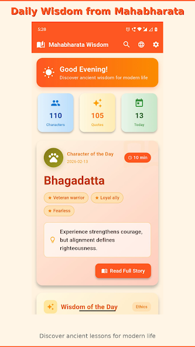
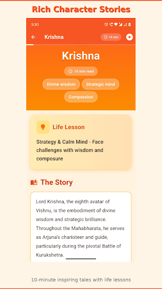
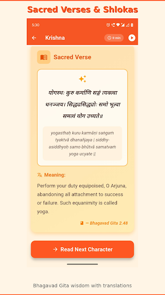
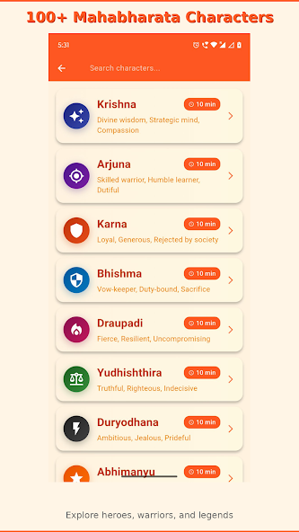
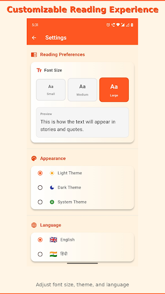
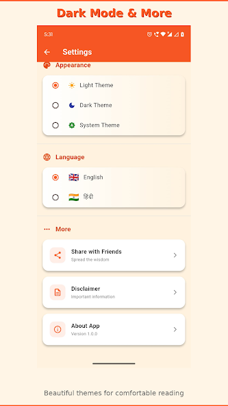
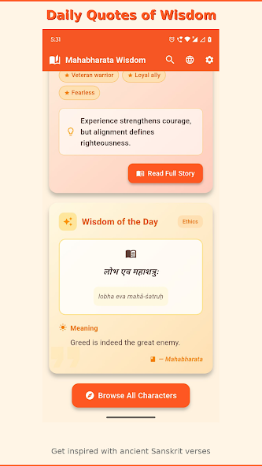

<div align="center">

# 🕉️ Mahabharata Wisdom

### Ancient Wisdom from the Mahabharata for Modern Life

[](https://flutter.dev)
[](https://dart.dev)
[](LICENSE)
[]()

<p align="center">
  
</p>

**Discover timeless teachings from 100+ legendary characters**  
**10-minute stories · Sacred verses · Modern life lessons**

[📱 Download](#-download) • [✨ Features](#-features) • [🖼️ Screenshots](#️-screenshots) • [🚀 Getting Started](#-getting-started)

---

</div>

## 📖 About

**Mahabharata Wisdom** brings the timeless teachings of the Mahabharata epic and Bhagavad Gita to your daily life. Whether you're facing career decisions, relationship challenges, or ethical dilemmas, the heroes and teachings of this 5,000-year-old epic offer profound guidance that remains powerfully relevant today.

### Why This App?

- 🎯 **Modern & Accessible**: Complex ancient wisdom simplified into engaging 10-minute stories
- 🎨 **Beautiful Design**: Stunning gradient themes, smooth animations, and intuitive interface
- 🔒 **Privacy-First**: Zero data collection, no tracking, completely offline-capable
- 🌍 **Bilingual**: Full content in English and Hindi (और हिंदी)
- 💰 **Always Free**: No ads, no subscriptions, no in-app purchases

---

## ✨ Features

<table>
<tr>
<td width="50%">

### 📚 100+ Character Stories

- Complete biographies of legendary heroes
- 10-minute inspiring tales
- Modern life lessons you can apply today
- Beautiful character-specific themes

### 🙏 Sacred Bhagavad Gita Verses

- 100+ Sanskrit shlokas
- Transliteration & pronunciation guide
- English and Hindi translations
- Deep meanings explained

### 🎯 Daily Inspiration

- Character of the Day (rotates daily)
- Wisdom of the Day quotes
- Reading progress tracking
- Favorite characters bookmarking

</td>
<td width="50%">

### 🌓 Customizable Experience

- **Dark Mode**: Easy on the eyes
- **Light Mode**: Clean & bright
- **System Theme**: Auto-matches device
- **Font Sizes**: Small, Medium, Large
- **Bilingual**: Switch languages anytime

### 🔍 Smart Features

- Instant character search
- Category filters
- Reading time estimates
- Progress tracking
- Share with friends

### 🔒 Privacy & Offline

- Zero data collection
- No user accounts required
- Completely offline capable
- All data stored locally

</td>
</tr>
</table>

---

## 🖼️ Screenshots

<div align="center">

### Home Screen & Character of the Day

<p align="center">
  
  &nbsp;&nbsp;&nbsp;
  
  &nbsp;&nbsp;&nbsp;
  
</p>

_Beautiful home screen with daily character, stats cards, and wisdom quotes_

---

### Character List & Search

<p align="center">
  
  &nbsp;&nbsp;&nbsp;
  
  &nbsp;&nbsp;&nbsp;
  
</p>

_Browse 100+ characters, customize your reading experience_

---

### Daily Wisdom & More

<p align="center">
  
  &nbsp;&nbsp;&nbsp;
  
</p>

_Wisdom quotes, dark mode, and full Hindi language support_

</div>

---

## 🎯 Featured Characters

<table>
<tr>
<td align="center" width="20%">
<br/>
<b>Krishna</b><br/>
<sub>Divine Wisdom<br/>Strategic Mind</sub>
</td>
<td align="center" width="20%">
<br/>
<b>Arjuna</b><br/>
<sub>Skilled Warrior<br/>Humble Learner</sub>
</td>
<td align="center" width="20%">
<br/>
<b>Draupadi</b><br/>
<sub>Strong Spirit<br/>Dignity</sub>
</td>
<td align="center" width="20%">
<br/>
<b>Karna</b><br/>
<sub>Loyal Ally<br/>Generous Soul</sub>
</td>
<td align="center" width="20%">
<br/>
<b>Bhishma</b><br/>
<sub>Vow-Keeper<br/>Duty-Bound</sub>
</td>
</tr>
</table>

<div align="center">
<i>...and 95 more legendary characters!</i>
</div>

---

## 📱 Download

<div align="center">

<a href="https://play.google.com/store/apps/details?id=com.mahabharata_wisdom"></a>
&nbsp;&nbsp;&nbsp;

<!--<a href="#"></a>-->

⭐ Star this repo to stay updated on the official release!

</div>

---

## 🚀 Getting Started

### Prerequisites

Before you begin, ensure you have installed:

- [Flutter SDK](https://flutter.dev/docs/get-started/install) (3.0 or higher)
- [Dart SDK](https://dart.dev/get-dart) (3.0 or higher)
- [Android Studio](https://developer.android.com/studio) or [VS Code](https://code.visualstudio.com/) with Flutter extensions
- [Xcode](https://developer.apple.com/xcode/) (for iOS development on macOS)

### Installation

1️⃣ **Clone the repository**

```bash
git clone https://github.com/theparmendrasingh/mahabharata-wisdom.git
cd mahabharata-wisdom
```

2️⃣ **Install dependencies**

```bash
flutter pub get
```

3️⃣ **Run the app**

```bash
# Check connected devices
flutter devices

# Run on connected device
flutter run

# Run on specific device
flutter run -d <device_id>
```

4️⃣ **Build for production**

```bash
# Android APK
flutter build apk --release

# Android App Bundle (for Play Store)
flutter build appbundle --release

# iOS (macOS only)
flutter build ios --release
```

---

## 📁 Project Structure

```
mahabharata_wisdom/
├── 📱 lib/
│   ├── main.dart                          # App entry point
│   │
│   ├── 📊 models/
│   │   ├── character.dart                 # Character data model
│   │   ├── quote.dart                     # Quote data model
│   │   └── app_settings.dart              # User settings model
│   │
│   ├── 📺 screens/
│   │   ├── home_screen.dart               # Main home page
│   │   ├── character_detail_screen.dart   # Character details & story
│   │   ├── character_list_screen.dart     # Browse all characters
│   │   ├── settings_screen.dart           # App settings
│   │   └── disclaimer_page.dart           # Legal disclaimer
│   │
│   ├── 🎨 widgets/
│   │   ├── character_card.dart            # Character preview card
│   │   ├── quote_card.dart                # Quote display widget
│   │   └── stats_card.dart                # Statistics card
│   │
│   └── 🔧 services/
│       ├── character_image_service.dart   # Character icons & gradients
│       └── storage_service.dart           # Local data persistence
│
├── 📦 assets/
│   ├── data/
│   │   └── mahabharata_characters.json    # All character data
│   └── images/
│       └── app_icon.png
│
├── 📸 screenshots/                         # App screenshots for README
├── 🤖 android/                             # Android-specific files
├── 🍎 ios/                                 # iOS-specific files
├── 🧪 test/                                # Unit & widget tests
│
├── 📄 pubspec.yaml                         # Dependencies & assets
├── 📖 README.md                            # This file
├── ⚖️ LICENSE                              # MIT License
└── 🤝 CONTRIBUTING.md                      # Contribution guidelines
```

---

## 🛠️ Tech Stack

<table>
<tr>
<td align="center" width="25%">
<br/>
<b>Flutter</b><br/>
<sub>UI Framework</sub>
</td>
<td align="center" width="25%">
<br/>
<b>Dart</b><br/>
<sub>Programming Language</sub>
</td>
<td align="center" width="25%">
<br/>
<b>Provider</b><br/>
<sub>State Management</sub>
</td>
<td align="center" width="25%">
<br/>
<b>Android</b><br/>
<sub>Platform</sub>
</td>
</tr>
</table>

### Key Dependencies

```yaml
dependencies:
  flutter:
    sdk: flutter
  provider: ^6.0.5 # State management
  shared_preferences: ^2.2.2 # Local data storage
  share_plus: ^7.2.1 # Social sharing
  flutter_animate: ^4.3.0 # Smooth animations
```

---

## 🎨 Key Features Explained

### 📚 Character Data Structure

Characters are stored in JSON format with rich bilingual content:

```json
{
  "id": 1,
  "name": {
    "en": "Krishna",
    "hi": "कृष्ण"
  },
  "key_traits": {
    "en": "Divine wisdom, Strategic mind, Compassion",
    "hi": "दिव्य ज्ञान, रणनीतिक मन, करुणा"
  },
  "life_lesson": {
    "en": "Strategy & Calm Mind - Face challenges with wisdom",
    "hi": "रणनीति और शांत मन - चुनौतियों का सामना करें"
  },
  "story": {
    "en": "Complete 10-minute story in English...",
    "hi": "पूरी कहानी हिंदी में..."
  },
  "shloka": {
    "sanskrit": "योगस्थः कुरु कर्माणि सङ्गं त्यक्त्वा धनञ्जय",
    "transliteration": "yogasthaḥ kuru karmāṇi saṅgaṃ tyaktvā dhanañjaya",
    "meaning": {
      "en": "Perform your duty with equanimity...",
      "hi": "समभाव के साथ अपना कर्तव्य करो..."
    },
    "reference": "Bhagavad Gita 2.48"
  }
}
```

### 🎨 Visual Theme System

Each character has a unique gradient and icon:

```dart
'krishna': {
  'gradient': [Color(0xFF1A237E), Color(0xFF3949AB)],  // Deep blue
  'icon': Icons.auto_awesome,
  'emoji': '✨'
},
'draupadi': {
  'gradient': [Color(0xFF880E4F), Color(0xFFAD1457)],  // Rich pink
  'icon': Icons.local_fire_department,
  'emoji': '🔥'
}
```

### 🌓 Dark Mode

Fully integrated dark mode that respects system preferences:

```dart
ThemeMode.system   // Auto-detect
ThemeMode.light    // Always light
ThemeMode.dark     // Always dark
```

### 🔍 Search & Filter

Instant search across all 100+ characters with smart filtering:

- Search by name
- Filter by category (Heroes, Warriors, Wise, etc.)
- Sort by reading time
- View favorites

---

## 🧪 Testing

```bash
# Run all tests
flutter test

# Run with coverage
flutter test --coverage

# Run specific test file
flutter test test/character_test.dart

# Run integration tests
flutter drive --target=test_driver/app.dart
```

---

## 🤝 Contributing

Contributions are what make the open-source community amazing! Any contributions you make are **greatly appreciated**.

### How to Contribute

1. 🍴 Fork the Project
2. 🌿 Create your Feature Branch (`git checkout -b feature/AmazingFeature`)
3. ✅ Commit your Changes (`git commit -m 'Add some AmazingFeature'`)
4. 📤 Push to the Branch (`git push origin feature/AmazingFeature`)
5. 🎉 Open a Pull Request

### Contribution Ideas

- 📚 Add more character stories
- 🌍 Improve translations (English/Hindi)
- 🎨 Enhance UI/UX design
- 🐛 Fix bugs and issues
- 📖 Improve documentation
- ✨ Add new features

See [CONTRIBUTING.md](CONTRIBUTING.md) for detailed guidelines.

---

## 📊 Project Stats

<div align="center">

| Metric                   | Count              |
| ------------------------ | ------------------ |
| 📖 Characters            | 100+               |
| 🙏 Bhagavad Gita Shlokas | 100+               |
| 🌍 Languages             | 2 (English, हिंदी) |
| ⏱️ Total Reading Time    | 1000+ minutes      |
| 📱 App Size              | ~15 MB             |
| 🔒 Data Collected        | 0 bytes            |
| 💰 Cost                  | Free Forever       |

</div>

---

## 🗺️ Roadmap

### ✅ Version 1.0 (Current)

- [x] 100+ character stories with life lessons
- [x] 100+ Bhagavad Gita verses
- [x] Bilingual support (English/Hindi)
- [x] Dark mode & theme customization
- [x] Reading progress tracking
- [x] Search & filter functionality
- [x] Daily character rotation
- [x] Completely offline capable

### 🚧 Version 1.1 (Next Release)

- [ ] Audio narration (Text-to-Speech)
- [ ] Bookmark specific verses
- [ ] Notes & highlights
- [ ] Daily notification with wisdom
- [ ] Character favorites system
- [ ] Reading statistics dashboard
- [ ] Share individual quotes as images

### 🔮 Version 1.2 (Future)

- [ ] Quiz mode for learning
- [ ] Character comparison tool
- [ ] Interactive family tree
- [ ] More languages (Tamil, Telugu, Kannada)
- [ ] Video explanations
- [ ] Community translations

### 💡 Version 2.0 (Vision)

- [ ] iOS release
- [ ] Web version
- [ ] Podcast integration
- [ ] AR character visualizations
- [ ] Community features

[📝 View Full Roadmap](https://github.com/yourusername/mahabharata-wisdom/projects/1)

---

## 📄 License

This project is licensed under the **MIT License** - see the [LICENSE](LICENSE) file for details.

### What This Means

✅ **You Can:**

- Use commercially
- Modify freely
- Distribute
- Use privately
- Sublicense

❌ **You Cannot:**

- Hold author liable
- Use author's name for endorsement

📋 **You Must:**

- Include original license
- Include copyright notice

---

## 🙏 Acknowledgments

### Content Sources

- **Mahabharata** - Ancient Sanskrit epic (public domain)
- **Bhagavad Gita** - Sacred Hindu scripture (public domain)
- **Translations** - Based on traditional scholarly interpretations

### Technologies & Tools

- [Flutter](https://flutter.dev) - Google's UI toolkit
- [Provider](https://pub.dev/packages/provider) - State management
- [Material Design](https://material.io) - Design system
- [Noto Sans Devanagari](https://fonts.google.com/noto/specimen/Noto+Sans+Devanagari) - Hindi font

### Inspiration

- Ancient wisdom keepers and storytellers
- Modern app design principles
- The timeless relevance of epic narratives

---

## 💬 Community & Support

<div align="center">

### Join Our Community!

[](https://github.com/yourusername/mahabharata-wisdom/issues)
[](https://github.com/yourusername/mahabharata-wisdom/stargazers)
[](https://github.com/yourusername/mahabharata-wisdom/network)

### Get Help

- 🐛 [Report a Bug](https://github.com/yourusername/mahabharata-wisdom/issues/new?template=bug_report.md)
- 💡 [Request a Feature](https://github.com/yourusername/mahabharata-wisdom/issues/new?template=feature_request.md)
- 💬 [Start a Discussion](https://github.com/yourusername/mahabharata-wisdom/discussions)
- 📧 [Email Support](mailto:support@mahabharatawisdom.app)

</div>

---

## 🌟 Star History

<div align="center">

[](https://star-history.com/#theparmendrasingh/MahabharataWisdom&Date)

**If you find this project useful, please consider giving it a ⭐!**

</div>

---

## 📜 Changelog

### [1.0.0] - 2026-02-13

#### 🎉 Initial Release

**Added**

- 100+ complete character biographies with 10-minute stories
- 100+ Bhagavad Gita shlokas with translations
- Bilingual support (English and Hindi)
- Dark mode and light mode themes
- System theme auto-detection
- Font size customization (Small, Medium, Large)
- Daily character rotation feature
- Wisdom of the Day quotes
- Reading progress tracking
- Character search functionality
- Category filtering
- Settings page with all customizations
- Share app functionality
- Disclaimer page
- Privacy-first architecture (zero data collection)
- Completely offline capable
- Beautiful gradient themes for each character
- Smooth animations and transitions

**Technical**

- Built with Flutter 3.0
- Provider state management
- Local storage with SharedPreferences
- Custom character image service
- Optimized for performance
- Tested on Android 5.0+

[View Full Changelog](CHANGELOG.md)

---

## 🎓 Educational Use

This app is perfect for:

- 🏫 **Schools**: Teaching Indian culture and Hindu philosophy
- 👨‍👩‍👧‍👦 **Families**: Sharing values and moral lessons with children
- 📚 **Students**: Learning about ancient epics and Sanskrit literature
- 👨‍🏫 **Teachers**: Educational resource for mythology and ethics
- 🔬 **Researchers**: Quick reference for Mahabharata characters
- 🧘 **Spiritual Seekers**: Daily wisdom and reflection

**Free for all educational purposes!**

---

## ❓ FAQ

<details>
<summary><b>Is this app really free?</b></summary>
<br/>
Yes! Completely free forever. No ads, no subscriptions, no in-app purchases, no hidden costs.
</details>

<details>
<summary><b>Do you collect my data?</b></summary>
<br/>
No. Zero data collection. No analytics, no tracking, no servers. Everything stays on your device. We respect your privacy completely.
</details>

<details>
<summary><b>Can I use this offline?</b></summary>
<br/>
Yes! All content is available offline after installation. No internet connection needed.
</details>

<details>
<summary><b>How accurate are the stories?</b></summary>
<br/>
Based on traditional scholarly interpretations of the Mahabharata. For academic study, please consult primary Sanskrit sources and multiple translations.
</details>

<details>
<summary><b>Can I contribute more characters?</b></summary>
<br/>
Absolutely! Contributions are welcome. Please follow the character JSON format and submit a pull request. See CONTRIBUTING.md for details.
</details>

<details>
<summary><b>When will iOS version be available?</b></summary>
<br/>
iOS version is in development! The codebase is cross-platform ready. Expected release: Q2 2026.
</details>

<details>
<summary><b>Can I translate to other languages?</b></summary>
<br/>
Yes! We welcome translations to Tamil, Telugu, Kannada, Bengali, and other languages. See our translation guidelines in CONTRIBUTING.md.
</details>

<details>
<summary><b>How can I support this project?</b></summary>
<br/>
⭐ Star the repo, 🔄 share with friends, 🐛 report bugs, 💡 suggest features, or 🤝 contribute code/content!
</details>

---

## 🔐 Security & Privacy

<div align="center">

### 🛡️ Privacy-First Architecture

| Feature           | Status  |
| ----------------- | ------- |
| Data Collection   | ❌ None |
| User Tracking     | ❌ None |
| Analytics         | ❌ None |
| Ads               | ❌ None |
| Third-party SDKs  | ❌ None |
| Internet Required | ❌ No   |
| User Accounts     | ❌ None |
| Cloud Storage     | ❌ None |

**Your data is YOUR data. Period.**

[Read Full Privacy Policy](PRIVACY_POLICY.md)

</div>

---

<div align="center">

## 🎉 Built With Love


**This app was built with:**

❤️ Passion for ancient wisdom  
🎨 Attention to beautiful design  
🔒 Respect for user privacy  
📚 Commitment to education  
🕉️ Reverence for timeless teachings

---

### 🕉️ Ancient Wisdom for Modern Life 🕉️

**Made with ❤️ using Flutter**

[⬆ Back to Top](#-mahabharata-wisdom)

---

**If this project helped you, consider giving it a ⭐ on GitHub!**

[](https://github.com/yourusername/mahabharata-wisdom)

</div>
